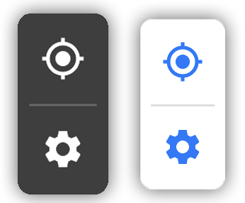

<p align="center">
  
</p>

# SegmentedButton

Welcome to **SegmentedButton,** a UI/UX framework for allowing users to quickly and easily insert a segmented button of sorts that replicates the split style button seen in the Apple Maps app on iOS 13.

[](https://www.apache.org/licenses/LICENSE-2.0)
[](https://img.shields.io/badge/pod-v0.1.0-blue)
[](https://twitter.com/bstillita)


## Features

- [x] Allows for an unlimited number of buttons
- [x] Buttons exist local to their scope and don't require any delegate conformance. 
- [x] Super performant
- [x] Pre-built UI (shadows, rounded corners, etc)
- [x] Dark/Light mode support out of the box.

## Usage

```
import SegmentedButton

class ViewController: UIViewController{
  
  func foo() {
    //Setup Location Button
    locationButton.tintColor = .buttonTintColor
    locationButton.setImage(UIImage(named: "ic_location")?.withRenderingMode(.alwaysTemplate), for: .normal)
    locationButton.addTarget(self, action: #selector(zoomMapToUserLocation), for: .touchUpInside)
    locationButton.contentEdgeInsets = UIEdgeInsets(top: 10.0, left: 10.0, bottom: 10.0, right: 10.0)

    //Setup Settings Button
    settingsButton.tintColor = .buttonTintColor
    settingsButton.setImage(UIImage(named: "settingsIcon")?.withRenderingMode(.alwaysTemplate), for: .normal)
    settingsButton.addTarget(self, action: #selector(openSettings), for: .touchUpInside)
    settingsButton.contentEdgeInsets = UIEdgeInsets(top: 10.0, left: 10.0, bottom: 10.0, right: 10.0)

    //Setup Split Button View
    let splitButton: SplitButton = SplitButton(buttons: [locationButton, settingsButton])
    self.view.addSubview(splitButton)

    //Update Split Button Constraints
    splitButton.snp.makeConstraints { (make) in
        make.top.equalTo(self.view.safeAreaLayoutGuide.snp.top).offset(16)
        make.right.equalToSuperview().inset(16)
    }
  }
}
```

## Requirements

* iOS 11.0+
* Xcode 9.0+

## Communication

- If you **need help**, use [Stack Overflow](http://stackoverflow.com/questions/tagged/segmentedbutton). (Tag 'segmentedbutton')
- If you'd like to **ask a general question**, use [Stack Overflow](http://stackoverflow.com/questions/tagged/segmentedbutton).
- If you **found a bug**, _and can provide steps to reliably reproduce it_, open an issue.
- If you **have a feature request**, open an issue.
- If you **want to contribute**, submit a pull request.

## Installation

> **Embedded frameworks require a minimum deployment target of iOS 11+.**
> - [Download SegmentedButton](mailto:bstillitano95@gmail.com)

## CocoaPods

[CocoaPods](http://cocoapods.org) is a dependency manager for Cocoa projects. You can install it with the following command:

```bash
$ gem install cocoapods
```

To integrate SegmentedButton's features into your Xcode project using CocoaPods, specify it in your `Podfile`:

```ruby
source 'https://github.com/CocoaPods/Specs.git'
platform :ios, '11.0'
use_frameworks!

pod 'SegmentedButton', '~> 0.1.0'
```

Then, run the following command:

```bash
$ pod install
```

## Change Log

SegmentedButton is a growing project and will encounter changes throughout its development. It is recommended that the [Change Log](https://github.com/bstillitano/SegmentedButton/blob/master/CHANGELOG.md) be reviewed prior to updating versions.

## License

Licensed under Apache 2.0

Copyright (C) 2020, Ordermentum Pty Ltd
All rights reserved.

THE SOFTWARE IS PROVIDED "AS IS", WITHOUT WARRANTY OF ANY KIND, EXPRESS OR
IMPLIED, INCLUDING BUT NOT LIMITED TO THE WARRANTIES OF MERCHANTABILITY,
FITNESS FOR A PARTICULAR PURPOSE AND NONINFRINGEMENT. IN NO EVENT SHALL THE
AUTHORS OR COPYRIGHT HOLDERS BE LIABLE FOR ANY CLAIM, DAMAGES OR OTHER
LIABILITY, WHETHER IN AN ACTION OF CONTRACT, TORT OR OTHERWISE, ARISING FROM,
OUT OF OR IN CONNECTION WITH THE SOFTWARE OR THE USE OR OTHER DEALINGS IN
THE SOFTWARE.
